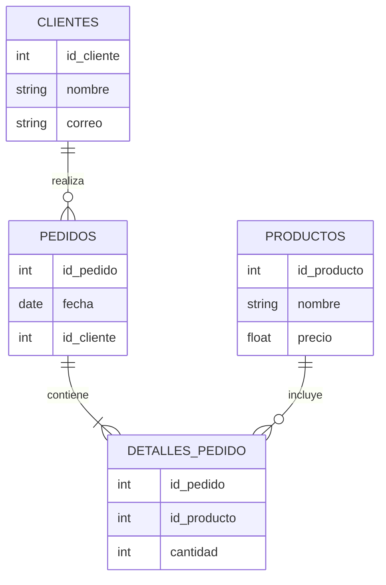

# Diagrama ERD - Sistema de Ventas

```mermaid
erDiagram
    CLIENTES ||--o{ PEDIDOS : realiza
    PEDIDOS ||--|{ DETALLES_PEDIDO : contiene
    PRODUCTOS ||--o{ DETALLES_PEDIDO : incluye
    CLIENTES {
        int id_cliente
        string nombre
        string correo
    }
    PEDIDOS {
        int id_pedido
        date fecha
        int id_cliente
    }
    DETALLES_PEDIDO {
        int id_pedido
        int id_producto
        int cantidad
    }
    PRODUCTOS {
        int id_producto
        string nombre
        float precio
    }
```
